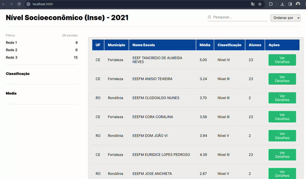

# Desafio tecnológico: Projeto Nível Socioeconômico (Inse) - 2021 ✨✨

## Desafios

- Backend: [ver documentação](https://github.com/fernandacostads/inse-project/tree/main/backend-inse-app#readme)
- Frontend: [ver documentação](https://github.com/fernandacostads/inse-project/blob/main/frontend-inse-app/README.md)

## Introdução ✨

Aqui você vai encontrar minha resolução neste desafio que foi proposto. Foi muito interessante pesquisar e aprender coisas novas.

### Inse

O "Índice Socioeconômico" [(INSE)](https://www.gov.br/inep/pt-br/acesso-a-informacao/dados-abertos/indicadores-educacionais/nivel-socioeconomico) é uma medida que visa avaliar o nível socioeconômico dos estudantes em escolas. Ele é usado para entender e analisar as condições socioeconômicas dos estudantes, fornecendo informações sobre a diversidade e as desigualdades existentes nas escolas.

### Pré-visualização

    

    

