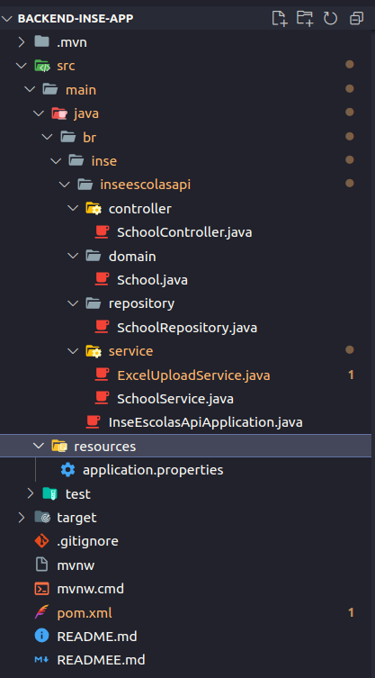
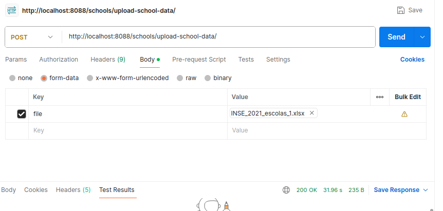

<a name="readme-top"></a>

<!-- &nbsp; -->

# API Inse - Nível Socioeconômico

Este é um projeto Java Spring Boot, utilizando o Maven como gerenciador de dependências e um banco de dados MySQL. O projeto tem como objetivo fornecer um serviço que importa dados de uma planilha para um database.

Exemplo de envio de dados da planilha para database:

<p align="center">
    
</p>

## Getting Started

### Pré-requisitos

- Java JDK: (versão 17.0.0 ou superior)[ver](https://www.oracle.com/br/java/technologies/downloads/#java17)
- Maven: [ver](https://maven.apache.org/)
- MySQL: [ver](https://www.mysql.com/)
- Postman: [ver](https://www.postman.com/)

### Configuração do Ambiente

1. Java JDK:

- Faça o download e instale o Java JDK conforme as instruções do site oficial.

2. Maven:

- Faça o download e instale o Maven conforme as instruções do site oficial.

3. MySQL:

- Faça o download e instale o MySQL conforme as instruções do site oficial.
- Crie um banco de dados para o projeto e configure as credenciais no arquivo application.properties (veja seção Configuração).

Aqui estão os passos básicos:

Iniciar o Servidor MySQL:

```
sudo service mysql start
```

Acessar o MySQL:

```
mysql -u root -p
```

Criar um Novo Banco de Dados:

```
CREATE DATABASE inse;
```

Criar um novo usuário e conceda os privilégios:

```
CREATE USER 'root'@'localhost' IDENTIFIED BY 'root123';
```

```
GRANT ALL PRIVILEGES ON inse.* TO 'root'@'localhost';
FLUSH PRIVILEGES;
```

Obs: Usuário e senha usada apenas em ambientes test e develop.

# Configuração do Projeto

1. Clone o Repositório e entre na pasta do projeto:

``` 
git clone git@github.com:fernandacostads/inse-escolas.git
cd inse-escolas/backend-inse-app
```

2. Configuração do Banco de Dados:

- Abra o arquivo src/main/resources/application.properties e ajuste as configurações do banco de dados conforme necessário.

3. Build e Execução:

- Execute o seguinte comando para construir e iniciar o projeto:

```
mvn spring-boot:run
```

# Estrutura do Projeto

<p align="center">
   
</p>

## Dependências

Principais dependências do projeto e suas versões.

Spring Boot Starter Data JPA:

```
<dependency>
    <groupId>org.springframework.boot</groupId>
    <artifactId>spring-boot-starter-data-jpa</artifactId>
</dependency>
```

Spring Boot Starter Web:

```
<dependency>
    <groupId>org.springframework.boot</groupId>
    <artifactId>spring-boot-starter-web</artifactId>
</dependency>
```

MySQL Connector Java:

```
<dependency>
    <groupId>com.mysql</groupId>
    <artifactId>mysql-connector-j</artifactId>
    <version>8.3.0</version>
    <scope>runtime</scope>
</dependency>
```

Project Lombok:

```
<dependency>
    <groupId>org.projectlombok</groupId>
    <artifactId>lombok</artifactId>
    <optional>true</optional>
</dependency>
```

Spring Boot Starter Test:

```
<dependency>
    <groupId>org.springframework.boot</groupId>
    <artifactId>spring-boot-starter-test</artifactId>
    <scope>test</scope>
</dependency>
```

Apache POI OOXML:

```
<dependency>
    <groupId>org.apache.poi</groupId>
    <artifactId>poi-ooxml</artifactId>
    <version>4.1.2</version>
</dependency>
```

**Ferramentas úteis que usei:**

- Controle de versão: Git.
- Ambientes de Desenvolvimento Integrado -(IDEs): Intelij.
- Gerenciador de dependências/automatizador de builds: Maven.
- Ambiente de criação: Spring Boot 2.75 ou superior.
- outros: Lombok, Spring Web, MySQL Driver, Spring Data JPA, Postman para testes.

### ✅ Exemplos

A API de Importação de Dados da planilha para o Banco de Dados permite que você envie uma planilha Excel contendo informações para serem processadas e armazenadas no banco de dados. Siga as instruções abaixo para realizar a importação de dados.

### Endpoint

- URL Base: http://localhost:8088
- Endpoint de Upload: /schools/upload-school-data/

### Método:

- POST

### Parâmetros:

- Key: file
- Value: Selecione a opção File e faça o upload da planilha Excel fornecida pelo INSE escolas 2021.

### Formato de Requisição (Postman ou outro que você tiver):

- Selecione o método POST.
- Digite a URL completa (URL Base + Endpoint).
- Escolha a opção form-data no corpo da requisição.
- Adicione a chave file e selecione File como o tipo de valor.
- Faça o upload da planilha Excel.

### Respostas:

- Status 200 OK: A importação foi concluída com sucesso.
- Status 400 Bad Request: Erros de validação ou formato inválido da planilha.
- Status 401 Unauthorized: Falha na autenticação, se aplicável.

<p align="center">
    
</p>

<br/>

<p align="right">(<a href="#readme-top">Voltar ao topo</a>)</p>

## Encerramento ✨

### Finalização e Agradecimentos

> ### A persistência é o caminho do êxito.
>
> Charles Chaplin

🤔 Ficou com alguma dúvida? Vem conversar comigo!

<p align="center">
  <a href="https://github.com/fernandacostads">
    
  </a>
</p>
<p align="center">
💬<a href="https://github.com/fernandacostads#-contacts">Contato</a>💬

<p align="right">(<a href="#readme-top">Voltar ao topo</a>)</p>
