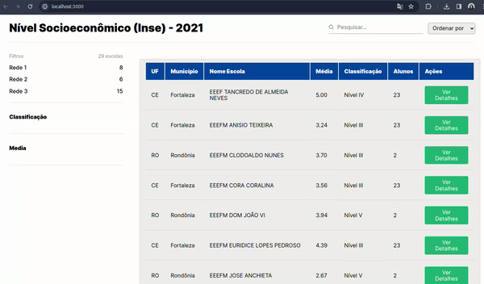
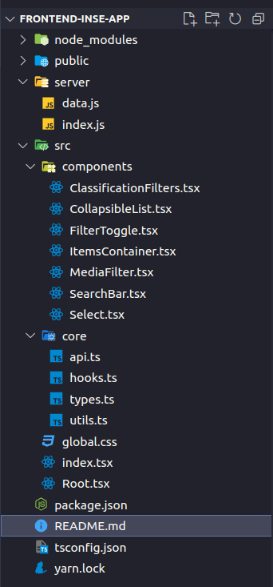

<a name="readme-top"></a>

<!-- &nbsp; -->

# Frontend Inse - Nível Socioeconômico

Este projeto React é uma aplicação que emprega a biblioteca JavaScript. Utilizando Yarn como gerenciador de dependências, o projeto tem por objetivo obter informações, mostrá-las de forma organizada tanto em ordem crescente quanto decrescente, e também permite filtrar dados conforme necessário.

Exemplo da aplicação:

<p align="center">
    
</p>

## Getting Started

### Pré-requisitos

- Node: [ver](https://nodejs.org/en)
- Yarn: [ver](https://yarnpkg.com/)

### Configuração do Ambiente

1. Node:

- Faça o download e instale o Node conforme as instruções do site oficial.

2. Yarn:

- Faça o download e instale o Yarn conforme as instruções do site oficial.

# Configuração do Projeto

1. Clone o Repositório e entre na pasta do projeto:

```
git clone git@github.com:fernandacostads/inse-escolas.git
cd inse-escolas/frontend-inse-app
```

3. Build e Execução:

- Execute o seguinte comando para construir e iniciar o projeto:

```
yarn
yarn start
```

- abra outra aba no terminal e execute o server:

```
yarn server
```

# Funcionalidades

- Listar dados
- Ordenação ascendente
- Ordenação descendente
- Busca
- Filtros
- Contagem de escolas

# Estrutura do Projeto

Este projeto foi inicializado com [Create React App](https://github.com/facebook/create-react-app).

<p align="center">
   
</p>

## Bibliotecas e ferramentas utilizadas

Principais ferramentas utilizadas no projet.
```
axios: ^0.27.2
cors: ^2.8.5
express: ^4.18.1
lodash: ^4.17.21
react: ^18.1.0
react-dom: ^18.1.0
react-icons: ^4.3.1
react-query: ^3.39.0
react-router-dom: ^6.3.0
react-scripts: 5.0.1
react-spinners: ^0.11.0
tachyons: ^4.12.0
typescript: ^4.4.2
web-vitals: ^2.1.0
@radix-ui/react-checkbox: ^0.1.5
@radix-ui/react-icons: ^1.1.1
@radix-ui/react-slider: ^0.1.4
@testing-library/jest-dom: ^5.14.1
@testing-library/react: ^13.0.0
@testing-library/user-event: ^13.2.1
@types/jest: ^27.0.1
@types/node: ^16.7.13
@types/react: ^18.0.0
@types/react-dom: ^18.0.0
```
**Outras ferramentas que usei:**

- Controle de versão: Git.
- Ambientes de Desenvolvimento Integrado -(IDEs): Visual Studio Code.
- Gerenciador de dependências/automatizador de builds: Yarn.
- Ambiente de criação: Create React App.

<p align="right">(<a href="#readme-top">Voltar ao topo</a>)</p>

## Encerramento ✨

### Finalização e Agradecimentos

> ### A persistência é o caminho do êxito.
>
> Charles Chaplin

🤔 Ficou com alguma dúvida? Vem conversar comigo!

<p align="center">
  <a href="https://github.com/fernandacostads">
    
  </a>
</p>
<p align="center">
💬<a href="https://github.com/fernandacostads#-contacts">Contato</a>💬

<p align="right">(<a href="#readme-top">Voltar ao topo</a>)</p>
